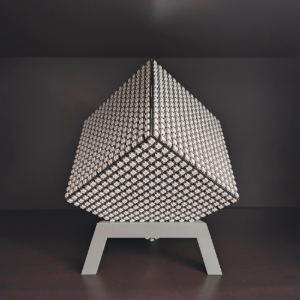
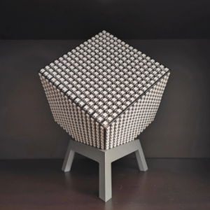

# RGB LED Cube Matrix

## Overview
This project creates a handheld six-sided LED cube featuring animations such as Conway's Game of Life.  
It runs CircuitPython and uses the Adafruit NeoPixel library for controlling the LEDs.  
The type and dimension of the LED panels are relatively flexible, depending on electrical and computational power considerations.

## Features
- Bluetooth Controls
- Animations crossing the edges between cube faces
  - Colorful worms  
    
  - Conway's Game of Life: Race War Edition  
    
  - Classic Snake Game  
    
  - More at [docs/media/](docs/media/)

## Future Plans
- [ ] Support for gravity-oriented animations through an accelerometer
- [ ] Timed animation slideshows
- [ ] Mobile app
- [ ] Construction and wiring documentation

## Hardware Overview
- QTPy ESP32-S3
- 6x WS2812B flexible strip 16x16 LED matrices
- 5V portable charger
- USB-C cable that supports data transfer

## Files and Folders
- `docs/` - Documentation on building the cube
  - `print_files/` - STL files for 3D printing parts
  - `README.md` - Instructions for wiring and building the cube
- `src/` - Contains the code and libraries to copy into the CircuitPython drive
  - `animations/` - Stores animation object files
  - `lib/` - Stores dependencies

## Setup Guide
**1. Cube Construction**  
- Refer to [docs/README.md](docs/README.md)

**2. Software Setup**
1. Install CircuitPython on ESP32
2. Clone the repository on your computer:  
   `git clone https://github.com/yourusername/led-cube-project.git`
3. Connect micro controller to computer with the USB-C transfer cable
4. Copy the files and folders in `src/` into the CircuitPython root folder
5. Declare the width of the cube in `code.py`

**3. Bluetooth Connection**
1. Install a serial Bluetooth terminal app (sends string bytes over BLE with the UART protocol):
   - **Android**: [Serial Bluetooth Terminal](https://play.google.com/store/apps/details?id=de.kai_morich.serial_bluetooth_terminal&hl=en_US)
   - **iOS**:
   - **Windows**: 
2. Connect to the `CIRCUITPY` device
3. Send the name of the desired animation