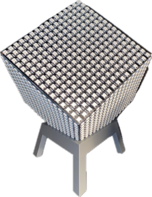

# RGB LED Cube Matrix

## Overview
This project creates a handheld six-sided LED cube featuring animations such as Conway's Game of Life.  
It runs CircuitPython and uses the Adafruit NeoPixel library for controlling the LEDs.  

## Features
- BLE Bluetooth Controls
- Cube traversing animations
  - RGB patterns  
    
  - Worms  
    
  - Conway's Game of Life: Race War Edition  
    
  - Classic Snake Game  
    
  - More at [docs/media/](docs/media/)

## Future Plans
- [ ] Support for gravity-oriented animations through an accelerometer
- [ ] Timed animation slideshows
- [ ] Mobile app
- [ ] Construction and wiring documentation

## Hardware Overview
- ESP32-S3 or microcontroller that supports CircuitPython and BlueTooth LE
- 6 individually addressable 8x8 or 16x16 LED matrices like WS2812B
- 5V portable charger or battery
- USB cable that supports data transfer
- 3D printer or something that can act as an internal frame

## Files and Folders
- `docs/` - Documentation of the cube
  - `media/` - Pictures and animation demos
  - `print_files/` - STL files for 3D printing parts
  - `README.md` - Instructions for wiring and building the cube
- `src/` - Contains all files to copy into the CircuitPython drive
  - `animations/` - Stores animation files
  - `lib/` - Stores dependencies

## Setup Guide
**1. Cube Construction**  
- Refer to [docs/README.md](docs/README.md)

**2. Software Setup**
1. Connect micro controller to computer with the USB data transfer cable
2. Install CircuitPython on the micro controller
3. Clone the repository on your computer:  
   `git clone https://github.com/yourusername/led-cube-project.git`
4. Copy the files and folders in `src/` into the CircuitPython root folder
5. Declare the pins and width of the cube in `code.py`

**3. Bluetooth Connection**
1. Install a serial Bluetooth terminal app (sends string bytes over BLE with the UART protocol):
   - **Android**: [Serial Bluetooth Terminal](https://play.google.com/store/apps/details?id=de.kai_morich.serial_bluetooth_terminal&hl=en_US)
   - **iOS**:
   - **Windows**: 
2. Connect to the `CIRCUITPY` device
3. Send the name of the desired animation